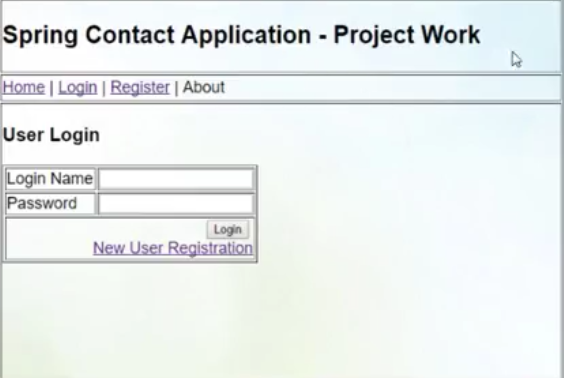
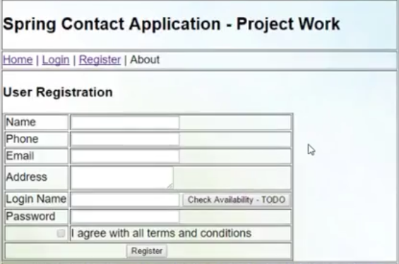
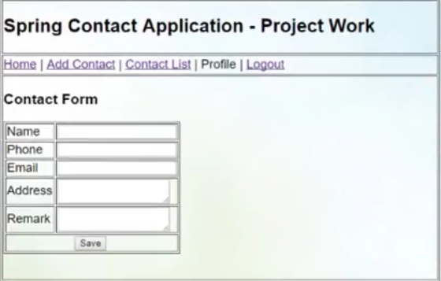
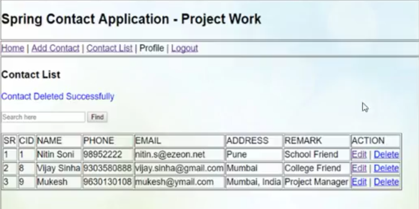
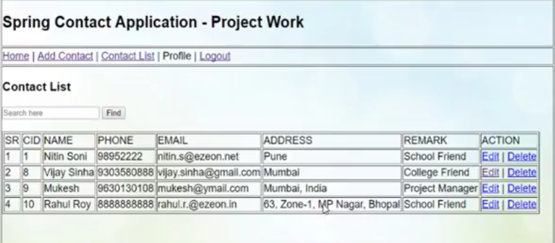

# Project Title #
Contact App

# Screen shots #







# Description #

 A web app build on java and Spring Web MVC. Users can save contact number which is a replacement of old analog phonebbok.

- Multi user Application.
- Roles: Use & Admin.
- User Registration.
- Login: User & Admin.
- Logout: User & Admin.
- Add contact.
- Delete Contact.
- Edit/ Update contact.
- List Contact.
- Search contact ( Free text).\
- Admin can see all registered users.
- Admin can block or active any user.

# Technology Used #

**Front End**
```
* Jsp 
* HTML, CSS, JavaScript
* JSTL
```

**Back End**
```
* Java
```
**Framework**
```
* Spring Boot
```
**Build Tool**
```
* Maven
```

**Database**
```
* MySql
```
**IDE**
```
* Net Beans
```
**Version Control**
```
* GitHub
```
**Server**
```
* Apache Tomcat
```
**Acknowledgment**
```
* Vikram Thakur
* Noman Ibrahim
```

