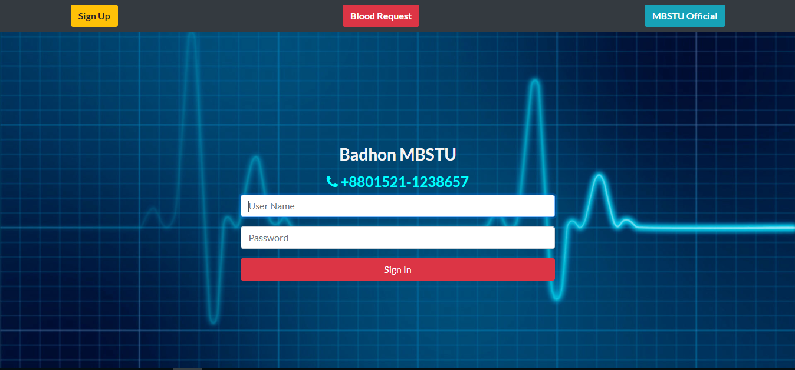
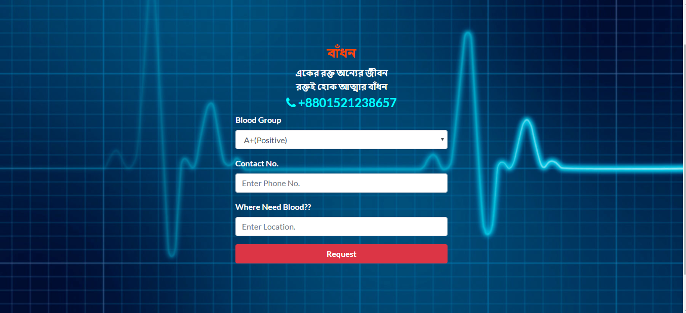
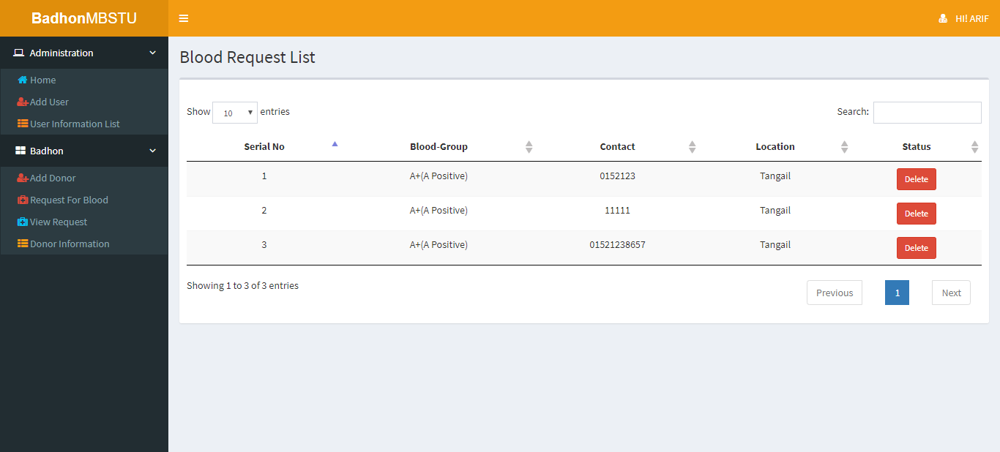
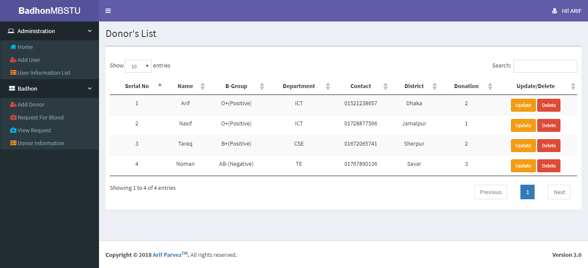
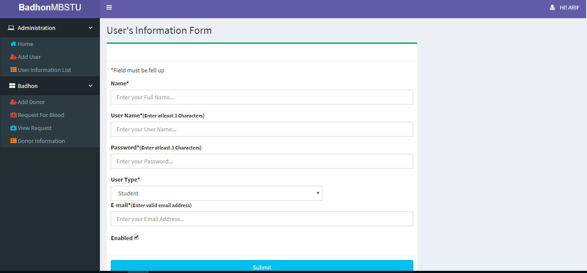
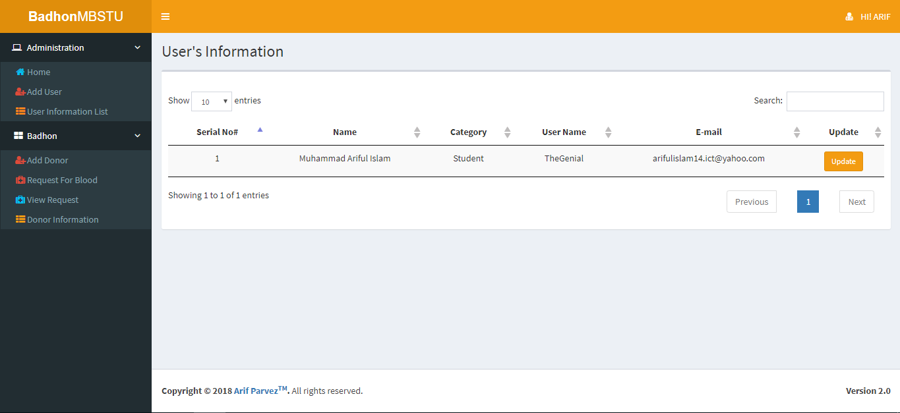

# Project Title #
Badhon MBSTU

# Screen shots #








# Description #

It is a web app application build for Badhon (Blood Donation Organization) Mawlana Bhashani Science and Technology University Branch.The following module we can achive from the web app.

- There are two kind of users: Admin and user.
- A user can Register himself by providing some information.
- User must login with valid cradentials to use the app.
- Any person(register or not) can request for blood.
- valid of user is checked by Spring security core.
- A user can add donar into the list.
- User can view donar list, search them but cannot edit or delete them.
- User can send message to the admin for any kind of query.
- An Admin can add,update,delete any number of users, drivers and buses.
- Admin's are responsible for taking care of blood request, managing donar and other services.
- Admin can take any kind of operation according to user request.

# Technology Used #

**Front End**
```
* Jsp 
* HTML, CSS, JavaScript
* JSTL
```

**Back End**
```
* Java
```
**Framework**
```
* Spring Boot
* Bootstrape
```
**Build Tool**
```
* Maven
```

**Database**
```
* Hibernet
* MySql
```
**IDE**
```
* Intellij IDEA
```
**Version Control**
```
* GitHub
```
**Server**
```
* Apache Tomcat
```
**Acknowledgment**
```
* Habibur Rahman Sumon
* Asifur Rahman
```

