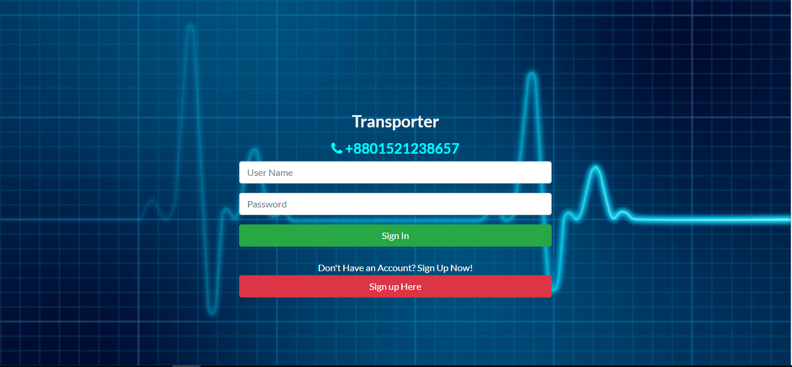
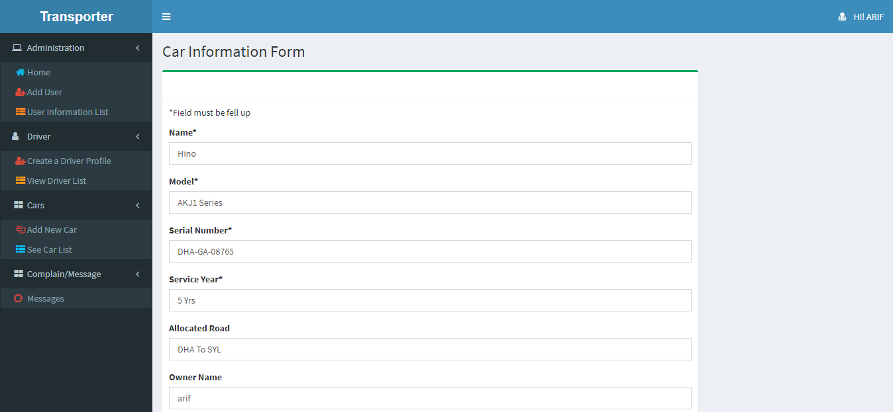
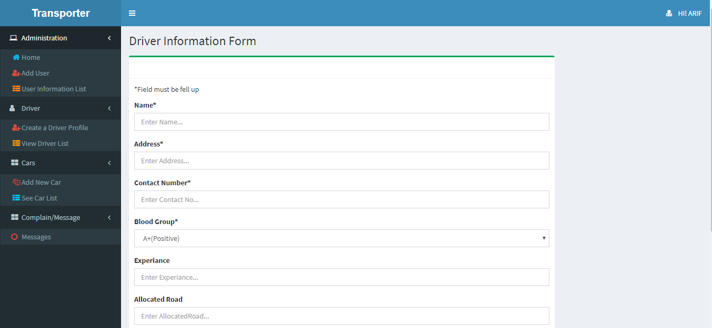
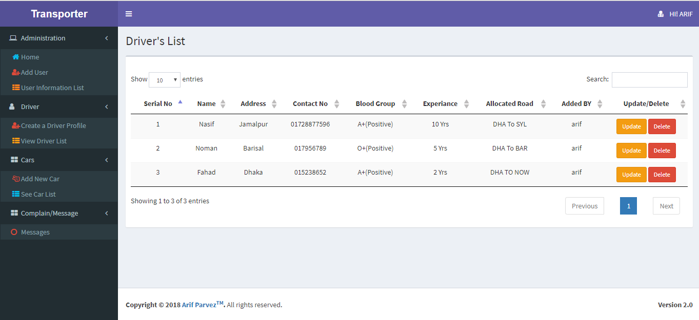
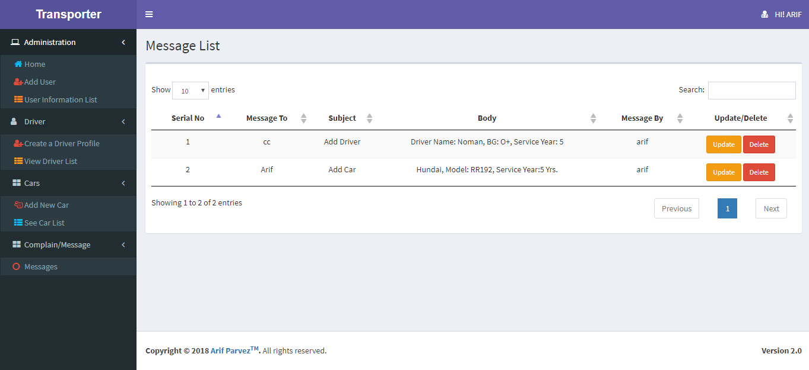

# Project Title #
Transporter's 

# Screen shots #








# Description #

It is a web app was made keeping intention in mind to make easy the administrative work of a
bus company .The following module we can achive from the web app.

- Users have two kind of role: Admin and user.
- A user can Register himself by providing some information.
- User must login with valid cradentials to use the app.
- valid of user is checked by Spring security core.
- A user can add own car into the list and allocate own drivers.
- User can view his/her added credential, search them but cannot edit or delete them.
- User can send message to the admin for any kind of query.
- An Admin can add,update,delete any number of users, drivers and buses.
- Admin can take any kind of operation according to user request.

# Technology Used #

**Front End**
```
* Jsp 
* HTML, CSS, JavaScript
* JSTL
```

**Back End**
```
* Java
```
**Framework**
```
* Spring Boot
* Bootstrape
```
**Build Tool**
```
* Maven
```

**Database**
```
* Hibernet
* MySql
```
**IDE**
```
* Intellij IDEA
```
**Version Control**
```
* GitHub
```
**Server**
```
* Apache Tomcat
```
**Acknowledgment**
```
* Habibur Rahman Sumon
* Asifur Rahman
```
